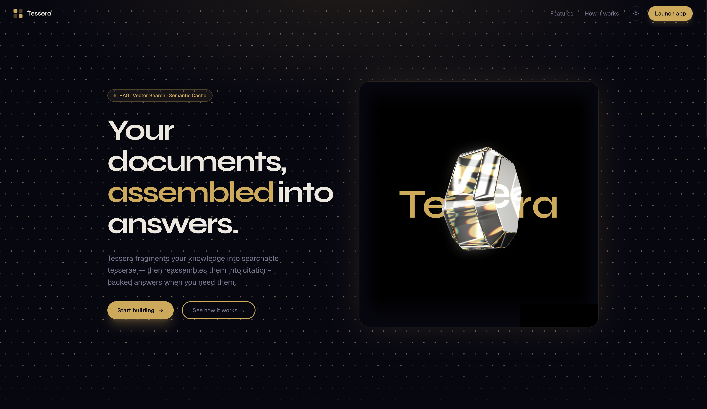

<div align="center">

# Tessera :: Client

**Next.js 16 · React 19 · Tailwind CSS 4 · Framer Motion · TypeScript**

[](https://www.typescriptlang.org)
[](https://nextjs.org)
[](https://react.dev)
[](https://tailwindcss.com)
[](https://framer.com/motion)
[](https://tessera-rag-ai.vercel.app)

**[Live Demo](https://tessera-rag-ai.vercel.app)**

</div>

---



---

## Overview

The Tessera frontend is a Next.js 16 application with two routes: a marketing landing page and a full-featured chat interface. The design language is built around the mosaic/tessera concept, warm obsidian backgrounds, Byzantine gold accents, and a four-tile SVG logo that maps directly to the idea of fragments assembled into meaning.

The landing page features a Spline 3D hero scene, an Aceternity canvas-based animated dot grid with dark-mode amber glow, and a Framer Motion navbar that morphs from a full-width bar into a floating pill on scroll. The chat interface manages conversation threads with localStorage persistence, paginated history loaded from MongoDB, drag-and-drop document uploads, and click-to-expand citation badges that surface readable chunk previews.

---

## Lighthouse Scores

| Category       | Score |
| -------------- | ----- |
| Performance    | 92    |
| Accessibility  | 95    |
| Best Practices | 100   |
| SEO            | 100   |

All SEO audits pass: `<title>` element, meta description, HTTP 200 status, descriptive link text, crawlable links, valid `hreflang`, not blocked from indexing. Open Graph and Twitter Card metadata is fully configured in `layout.tsx`.

---

## Project Structure

```
client/
├── src/
│   ├── app/
│   │   ├── layout.tsx            # Root layout, Syne + Geist + Geist Mono fonts,
│   │   │                         # ThemeProvider, full OG/Twitter metadata, security headers
│   │   ├── page.tsx              # Landing page, Navbar Hero Features HowItWorks CTA Footer
│   │   ├── globals.css           # @theme inline design tokens, dark/light CSS variables,
│   │   │                         # custom scrollbar, dot-grid utility
│   │   └── chat/
│   │       └── page.tsx          # Chat route, mounts ChatInterface, chat page metadata
│   ├── components/
│   │   ├── chat/
│   │   │   ├── ChatInterface.tsx  # Root layout: sidebar overlay (mobile), panel toggle,
│   │   │   │                      # namespace badge, threadId display, "New chat" clear
│   │   │   ├── MessageList.tsx    # Scroll container, "Load older messages" button at top,
│   │   │   │                      # smart auto-scroll (only for real-time, not history loads),
│   │   │   │                      # animated thinking dots
│   │   │   ├── ChatMessage.tsx    # Bubble layout, user right (gold bg) / assistant left
│   │   │   │                      # (surface bg), citation badges below assistant messages
│   │   │   ├── CitationBadge.tsx  # Click-to-expand Framer popover with source + chunkId
│   │   │   │                      # + readablePreview, closes on outside click
│   │   │   ├── ChatInput.tsx      # Auto-resize textarea (max 200px), Enter sends,
│   │   │   │                      # Shift+Enter newline, animated send button
│   │   │   └── KBPanel.tsx        # react-dropzone area (.pdf/.txt/.md, max 10MB),
│   │   │                          # namespace text input + existing namespace chips,
│   │   │                          # source label field, animated upload status card
│   │   ├── landing/
│   │   │   ├── Hero.tsx           # 2-column grid, staggered headline animation + Spline
│   │   │   │                      # iframe (dark-mode edge fades, watermark cover)
│   │   │   │                      # DottedGlowBackground behind content
│   │   │   ├── Features.tsx       # 4-card viewport-triggered stagger, hover glow effect
│   │   │   ├── HowItWorks.tsx     # 3-step horizontal layout with gold gradient connector line
│   │   │   ├── CTA.tsx            # Radial glow card with "Start building" CTA
│   │   │   └── Footer.tsx         # Minimal footer, logo + tagline
│   │   ├── layout/
│   │   │   ├── Navbar.tsx         # Framer Motion spring, borderRadius 0→100, maxWidth 9999→740,
│   │   │   │                      # marginTop 0→16 on scroll past 60px. Background blur/color
│   │   │   │                      # on separate layer to prevent animation conflict
│   │   │   ├── TesseraLogo.tsx    # 4-rect SVG, 2 full opacity, 2 at 35%, maps to mosaic concept
│   │   │   └── ThemeToggle.tsx    # AnimatePresence sun↔moon swap with rotate+fade transition
│   │   ├── providers/
│   │   │   └── ThemeProvider.tsx  # next-themes wrapper, defaultTheme: "dark", enableSystem: false
│   │   └── ui/
│   │       ├── button.tsx         # shadcn Button with cva variants
│   │       └── dotted-glow-background.tsx  # Aceternity canvas component, stable dot grid,
│   │                                        # per-dot phase+speed, CSS variable color resolution,
│   │                                        # ResizeObserver + IntersectionObserver, dark amber glow
│   ├── hooks/
│   │   ├── useChat.ts            # useState for messages + threadId
│   │   │                         # localStorage persistence ("tessera_thread_id")
│   │   │                         # Hydrates last 20 messages on mount silently
│   │   │                         # loadMore(), prepends older pages at top, skip+PAGE_SIZE
│   │   │                         # send(), optimistic user bubble, then API call
│   │   │                         # clear(), wipes state + localStorage
│   │   └── useKB.ts              # uploadState: idle/uploading/success/error FSM
│   │                             # fetchNamespaces() on mount + after each upload
│   │                             # resetUploadState() for dismissing status card
│   ├── lib/
│   │   ├── api.ts                # chatWithAgent(), fetchHistory(threadId, skip, limit)
│   │   │                         # uploadToKB(file, namespace, source?), listNamespaces()
│   │   └── utils.ts              # shadcn cn(), clsx + tailwind-merge
│   └── types/
│       └── index.ts              # Citation, ChatMessage, UploadResponse
├── public/
│   ├── og-image.png              # Open Graph image, 1728×1002px
│   └── tessera.svg               # Tessera wordmark
└── next.config.ts                # compress: true, security headers (X-Frame-Options,
                                  # X-Content-Type-Options, Referrer-Policy,
                                  # Permissions-Policy), Spline CDN remotePattern
```

---

## Design System

### Color Tokens

| Token         | Dark Mode | Light Mode |
| ------------- | --------- | ---------- |
| `--bg`        | `#070711` | `#F7F4EE`  |
| `--surface`   | `#0D0D1C` | `#EDE9E1`  |
| `--surface-2` | `#131328` | `#E3DDD3`  |
| `--accent`    | `#D4A84B` | `#A87C1A`  |
| `--fg`        | `#EDE8DF` | `#1A1625`  |
| `--muted`     | `#7A7590` | `#7A7068`  |

Tokens are defined as CSS custom properties and surfaced to Tailwind via `@theme inline` in `globals.css`, which generates `bg-bg`, `text-accent`, `border-border` and all other utilities automatically for both modes.

### Typography

| Role               | Font       | Weights             |
| ------------------ | ---------- | ------------------- |
| Display / headings | Syne       | 400 500 600 700 800 |
| Body / UI          | Geist Sans | 400 500             |
| Code / mono        | Geist Mono | 400                 |

### Key Animation Patterns

**Navbar morph**: Framer Motion `animate` on `borderRadius`, `maxWidth`, `marginTop` simultaneously with a spring (`stiffness: 260, damping: 28`). The background blur is on a separate `<div>` with a CSS `transition-all` to avoid conflicting with the shape animation.

**Message entrance**: each `ChatMessage` animates `opacity: 0→1` and `y: 12→0` on mount. `AnimatePresence` with `initial: false` prevents re-animating the history on hydration.

**Dot grid**: Aceternity `DottedGlowBackground`: per-dot triangle-wave alpha (0.25→0.8), `shadowBlur` applied only when `alpha > 0.6`, `ResizeObserver` for layout changes, `IntersectionObserver` to pause animation when off-screen. In dark mode the glow color resolves to `--color-amber-600`.

---

## State Architecture

### `useChat`: conversation state

```
localStorage["tessera_thread_id"]
        │ on mount (once via hydrated ref)
        ▼
fetchHistory(stored, skip=0, limit=20)
        │ → setMessages(hydrated[])
        │ → setHasMore(res.hasMore)
        │ → setHistorySkip(20)
        │
send(content)
        │ → optimistic user bubble
        │ → chatWithAgent({ message, namespace, threadId })
        │ → setThreadId(res.threadId)  → localStorage.setItem()
        │ → append assistant bubble with citations
        │
loadMore()
        │ → fetchHistory(threadId, historySkip, PAGE_SIZE)
        │ → prepend older messages at top
        │ → setHistorySkip(skip + PAGE_SIZE)
        │
clear()  →  setMessages([]) + localStorage.removeItem()
```

### `useKB`: knowledge base state

```
mount → fetchNamespaces() → setNamespaces([])

upload(file, namespace, source?)
  → setUploadState("uploading")
  → uploadToKB(file, namespace, source)
  → setLastUpload(res)
  → setUploadState("success" | "error")
  → fetchNamespaces()   ← refreshes chips after new namespace created
```

---

## Environment Variables

| Variable                   | Required | Description                    | Example                                     |
| -------------------------- | -------- | ------------------------------ | ------------------------------------------- |
| `NEXT_PUBLIC_API_BASE_URL` | Yes      | Backend base URL               | `https://tessera-rag-ai-backend.vercel.app` |
| `NEXT_PUBLIC_SPLINE_URL`   | Yes      | Spline scene public viewer URL | `https://prod.spline.design/...`            |

---

## Local Development

```bash
cd client
cp .env.example .env.local
# Set NEXT_PUBLIC_API_BASE_URL and NEXT_PUBLIC_SPLINE_URL
yarn install
yarn dev
```

Runs on `http://localhost:3000`. Requires the backend to be running or `NEXT_PUBLIC_API_BASE_URL` pointed at the deployed backend.

---

## Build

```bash
yarn build
yarn start
```

`next build` runs type checking, static analysis, and generates the optimized production bundle. Security headers and compression are applied at the Next.js config level.

---

## Deployment

```bash
vercel --prod
```

Set `NEXT_PUBLIC_API_BASE_URL` and `NEXT_PUBLIC_SPLINE_URL` in the Vercel project environment variables before deploying.

**Live:** [tessera-rag-ai.vercel.app](https://tessera-rag-ai.vercel.app)
